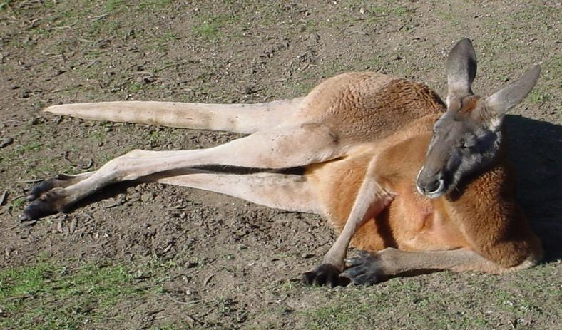

# Exercice-Cadavre-Exquis-Nicolas

# Le kangourou qui avait soif.

L'histoire se passe dans une plaine désertique fort fort loitaine.

Les chameaux et les kangourous vivent en harmonie.

Lors de la grande sécheresse les chameaux étaient tranquille mais Gérard lui..

Il avait fort soif , rien que une goute d'eau lui ferait plaisir.

Mais l'eau ce fait de plus en plus rare.

[comment]: <> (Gérard est un kangourou)

Il décida d'aller voir les chameaux pour leur demander de le guider vers la source d'eau la plus proche afin qu'ils puissent tous se désaltérer. Il arriva à les convaincre de le suivre, sous cette chaleur insupportable, en leur promettant à la fin du voyage... De les inclure dans son plan de rentabilisation du peu d'eau qu'il restait dans la plaine.

Arrivé au plus bel endroit qu'il lui ai jamais été donné de voir . Effectivement , il est vrai qu'alors encore enfant , sa maman aimait lui raconter des histoires sur un lieu MAGIQUE , un endroit où il y a même des arbres  et ou l'herbe et les fourrés sont si verts et luxuriants ... 

Mais c'est alors qu'un dingo surgit de nulle part pour les chasser. Les chameaux fuirent mais tombèrent dans un cul-de-sac, quannd tout à coup ...
